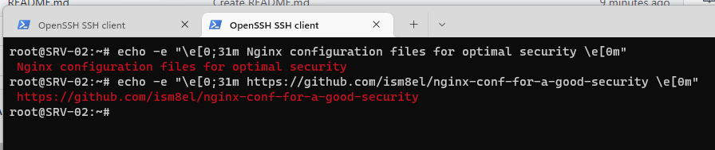

# Nginx configuration files for optimal security 

If like me you are tired of modifying your Nginx configuration files every time to optimize your security, here are some close.\
The files are commented, indented and all security recommendations have been applied.

Feel free to suggest changes if you see something to improve.

Tested with: Nginx/1.18.0

 
